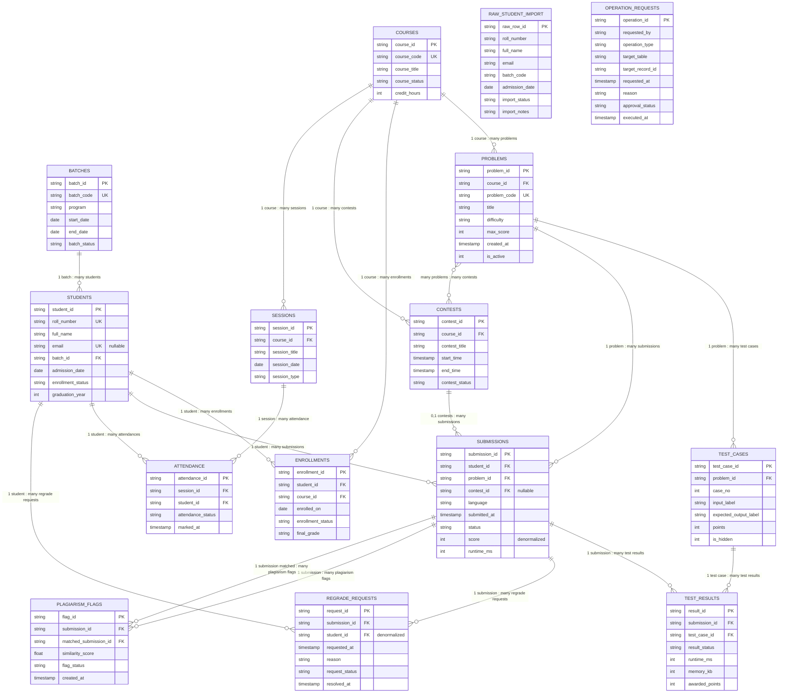

# Entity Relationship Diagram (ERD)

## Mermaid ER Diagram

---

## Detailed Relationship Description

### 1. One-to-Many Relationships

#### BATCHES → STUDENTS
- **Cardinality:** 1 batch : many students
- **Type:** Mandatory (FK NOT NULL)
- **Constraint:** REFERENCES batches.batch_id ON DELETE RESTRICT
- **Explanation:** Every student belongs to exactly one batch; batch cannot be deleted if it has students

#### COURSES → ENROLLMENTS
- **Cardinality:** 1 course : many enrollments
- **Type:** Mandatory (FK NOT NULL)
- **Constraint:** REFERENCES courses.course_id ON DELETE CASCADE
- **Explanation:** Course records each enrollment; if course deleted, enrollments cascade

#### COURSES → PROBLEMS
- **Cardinality:** 1 course : many problems
- **Type:** Mandatory (FK NOT NULL)
- **Constraint:** REFERENCES courses.course_id ON DELETE CASCADE
- **Explanation:** Each problem belongs to a course; deleting course deletes its problems

#### COURSES → CONTESTS
- **Cardinality:** 1 course : many contests
- **Type:** Mandatory (FK NOT NULL)
- **Constraint:** REFERENCES courses.course_id ON DELETE RESTRICT
- **Explanation:** Contest organized within course; cannot delete course with active contests

#### COURSES → SESSIONS
- **Cardinality:** 1 course : many sessions
- **Type:** Mandatory (FK NOT NULL)
- **Constraint:** REFERENCES courses.course_id ON DELETE CASCADE
- **Explanation:** Sessions belong to courses; delete course, delete its sessions

#### STUDENTS → ENROLLMENTS
- **Cardinality:** 1 student : many enrollments
- **Type:** Mandatory (FK NOT NULL)
- **Constraint:** REFERENCES students.student_id ON DELETE CASCADE
- **Explanation:** Student enrolls in multiple courses; deleting student cascades to enrollments

#### STUDENTS → SUBMISSIONS
- **Cardinality:** 1 student : many submissions
- **Type:** Mandatory (FK NOT NULL)
- **Constraint:** REFERENCES students.student_id ON DELETE CASCADE
- **Explanation:** Student submits many solutions; deleting student cascades submissions

#### STUDENTS → ATTENDANCE
- **Cardinality:** 1 student : many attendance records
- **Type:** Mandatory (FK NOT NULL)
- **Constraint:** REFERENCES students.student_id ON DELETE CASCADE
- **Explanation:** Track student's attendance across sessions; delete student cascades attendance

#### STUDENTS → REGRADE_REQUESTS
- **Cardinality:** 1 student : many regrade requests
- **Type:** Mandatory (FK NOT NULL)
- **Constraint:** REFERENCES students.student_id ON DELETE CASCADE
- **Explanation:** Student makes multiple regrade requests; delete student cascades requests

#### PROBLEMS → TEST_CASES
- **Cardinality:** 1 problem : many test cases
- **Type:** Mandatory (FK NOT NULL)
- **Constraint:** REFERENCES problems.problem_id ON DELETE CASCADE
- **Explanation:** Each problem has multiple test cases; deleting problem deletes its test cases

#### PROBLEMS → SUBMISSIONS
- **Cardinality:** 1 problem : many submissions
- **Type:** Mandatory (FK NOT NULL)
- **Constraint:** REFERENCES problems.problem_id ON DELETE CASCADE
- **Explanation:** Problem receives many submissions; deleting problem cascades submissions

#### SUBMISSIONS → TEST_RESULTS
- **Cardinality:** 1 submission : many test results
- **Type:** Mandatory (FK NOT NULL)
- **Constraint:** REFERENCES submissions.submission_id ON DELETE CASCADE
- **Explanation:** Each submission generates multiple test results (one per test case); delete submission cascades results

#### TEST_CASES → TEST_RESULTS
- **Cardinality:** 1 test case : many results
- **Type:** Mandatory (FK NOT NULL)
- **Constraint:** REFERENCES test_cases.test_case_id ON DELETE CASCADE
- **Explanation:** Test case is run many times across submissions; results reference test case

#### CONTESTS → SUBMISSIONS (Optional)
- **Cardinality:** 0..1 contest : many submissions
- **Type:** Optional (FK NULLABLE)
- **Constraint:** REFERENCES contests.contest_id ON DELETE SET NULL
- **Explanation:** Submission can be made during contest (optional) or as practice; if contest deleted, submission persists with NULL contest

#### SESSIONS → ATTENDANCE
- **Cardinality:** 1 session : many attendance records
- **Type:** Mandatory (FK NOT NULL)
- **Constraint:** REFERENCES sessions.session_id ON DELETE CASCADE
- **Explanation:** Each session records attendance for many students; delete session cascades attendance

#### SUBMISSIONS → REGRADE_REQUESTS
- **Cardinality:** 1 submission : many regrade requests
- **Type:** Mandatory (FK NOT NULL)
- **Constraint:** REFERENCES submissions.submission_id ON DELETE CASCADE
- **Explanation:** A submission can have multiple regrade requests; delete submission cascades requests

#### SUBMISSIONS → PLAGIARISM_FLAGS (both directions)
- **Cardinality:** 1 submission : many plagiarism flags (as submission_id or matched_submission_id)
- **Type:** Mandatory (FK NOT NULL)
- **Constraints:**
  - `submission_id` REFERENCES submissions.submission_id ON DELETE CASCADE
  - `matched_submission_id` REFERENCES submissions.submission_id ON DELETE CASCADE
- **Explanation:** A submission can be flagged with many other submissions; delete submission cascades associated flags

---

### 2. Many-to-Many Relationships

#### CONTESTS ↔ PROBLEMS (via CONTEST_PROBLEMS)
- **Cardinality:** many contests : many problems
- **Type:** Bridge table (junction table)
- **Primary Key:** (contest_id, problem_id)
- **Constraints:**
  - contest_id REFERENCES contests.contest_id ON DELETE CASCADE
  - problem_id REFERENCES problems.problem_id ON DELETE CASCADE
- **Additional Column:** problem_order (display order in contest)
- **Explanation:** Contests contain multiple problems; problems can appear in multiple contests. Bridge table enables flexible composition.

---

### 3. Self-Referencing Relationships

#### PLAGIARISM_FLAGS Self-Reference Prevention
- **Structure:** submission_id and matched_submission_id both reference submissions
- **Constraint:** `CHECK (submission_id ≠ matched_submission_id)`
- **Purpose:** Prevents flagging a submission against itself
- **Data Quality Issue Found:** PF0008 violates this (self-plagiarism), should be deleted

---

### 4. Optional Foreign Keys

#### ENROLLMENTS.final_grade (NULLABLE)
- Not a FK, but conditional attribute
- Only populated when enrollment_status = 'completed'

#### SUBMISSIONS.contest_id (NULLABLE)
- Optional FK to contests
- Submission can be made outside contests (practice)
- ON DELETE SET NULL prevents cascade deletion (submission persists)

#### STUDENTS.email (NULLABLE)
- Not a FK, but unique column that can be NULL
- Represented as UNIQUE INDEX WHERE email IS NOT NULL

#### REGRADE_REQUESTS.resolved_at (NULLABLE)
- Not a FK, but conditional timestamp
- NULL for open requests, filled when request is resolved

#### RAW_STUDENT_IMPORT (No FKs)
- Intentionally loose staging table
- No FK constraints to allow import of incomplete/invalid data
- Validation happens at application layer before accepting into main tables

---

### 5. Denormalized Columns (Tradeoffs)

#### SUBMISSIONS.score (Denormalized)
- **Derived From:** SUM(test_results.awarded_points)
- **Reason:** Performance (avoids expensive GROUP BY on query)
- **Maintenance:** Triggers on test_results to update submission.score
- **Issue in Data:** Multiple submissions have inconsistent scores vs test results

#### REGRADE_REQUESTS.student_id (Denormalized)
- **Derived From:** submissions.student_id (via submission_id FK)
- **Reason:** Direct access to student; enables validation constraint
- **Maintenance:** Application-level validation ensures consistency
- **Benefit:** Catches data corruption; enables quick filtering by student

---

## Visual Relationship Summary Table

| From Table | To Table | Relationship Type | Cardinality | FK Constraint | Notes |
|------------|----------|-------------------|-------------|---------------|-------|
| batches | students | 1:N | 1 batch : * students | NOT NULL | Parent can't delete if has students (RESTRICT) |
| courses | enrollments | 1:N | 1 course : * enrollments | NOT NULL | Cascade on delete |
| courses | problems | 1:N | 1 course : * problems | NOT NULL | Cascade on delete |
| courses | contests | 1:N | 1 course : * contests | NOT NULL | Restrict on delete |
| courses | sessions | 1:N | 1 course : * sessions | NOT NULL | Cascade on delete |
| students | enrollments | 1:N | 1 student : * enrollments | NOT NULL | Cascade on delete |
| students | submissions | 1:N | 1 student : * submissions | NOT NULL | Cascade on delete |
| students | attendance | 1:N | 1 student : * attendance | NOT NULL | Cascade on delete |
| students | regrade_requests | 1:N | 1 student : * requests | NOT NULL | Cascade on delete |
| problems | test_cases | 1:N | 1 problem : * test_cases | NOT NULL | Cascade on delete |
| problems | submissions | 1:N | 1 problem : * submissions | NOT NULL | Cascade on delete |
| test_cases | test_results | 1:N | 1 test_case : * results | NOT NULL | Cascade on delete |
| contests | submissions | 0,1:N | 0-1 contest : * submissions | NULLABLE | Set NULL on delete; practice submissions have no contest |
| sessions | attendance | 1:N | 1 session : * attendance | NOT NULL | Cascade on delete |
| submissions | regrade_requests | 1:N | 1 submission : * requests | NOT NULL | Cascade on delete |
| submissions | plagiarism_flags | 1:N | 1 submission : * flags | NOT NULL | Cascade on delete |
| contests | problems | M:N | * contests : * problems | Composite FK | Bridge table (contest_problems) |
| submissions | submissions | M:M asymmetric | * submissions : * submissions | Directional | Via plagiarism_flags (NOT self-referencing) |

---

## Key Design Patterns Used

### 1. **Bridge/Junction Table** (contest_problems)
- Enables flexible many-to-many without foreign key constraints between contests and problems
- Includes problem_order for sequencing problems within contests

### 2. **Denormalization for Performance**
- SUBMISSIONS.score: Stored to avoid expensive aggregation queries
- REGRADE_REQUESTS.student_id: Stored for quick filtering and validation

### 3. **Cascade Delete Strategy**
- CASCADE: When parent is deleted, dependent children are deleted
  - Used for: enrollments, problems, test_cases, submissions, test_results, sessions, attendance
  - Rationale: Children have no meaning without parent
- RESTRICT: When parent is deleted, operation is rejected if children exist
  - Used for: batches, contests
  - Rationale: Administrative safeguard; don't accidentally delete academic structures
- SET NULL: When parent is deleted, FK becomes NULL
  - Used for: contests in submissions
  - Rationale: Submissions exist independently; contest deletion doesn't invalidate them

### 4. **Staging Table Pattern** (raw_student_import)
- Intentionally loose schema (no FK constraints)
- Allows import of incomplete/invalid data for validation
- Application layer validates and migrates to main tables

### 5. **Audit Table Pattern** (operation_requests)
- Tracks all administrative changes
- No FK to operational tables (independent audit trail)
- Enables rollback and compliance tracking

---

## Data Integrity Considerations

### Referential Integrity
- All FK relationships enforced at DB level
- Cascade/Restrict/SetNull strategies balance safety and flexibility

### Domain Constraints
- CHECK constraints validate enum values (status, difficulty, etc.)
- CHECK constraints validate ranges (scores, points, similarity)
- CHECK constraints validate temporal relationships (start_time < end_time, dates in past)

### Uniqueness Constraints
- PKs ensure each record is unique
- Candidate keys identified for natural business keys (batch_code, course_code, etc.)
- UNIQUE indexes with partial conditions (email WHERE NOT NULL) allow NULL repeats

